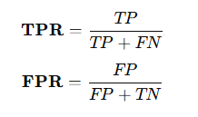
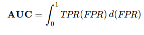
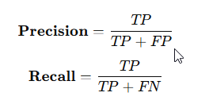
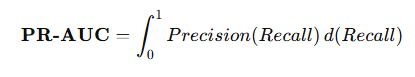
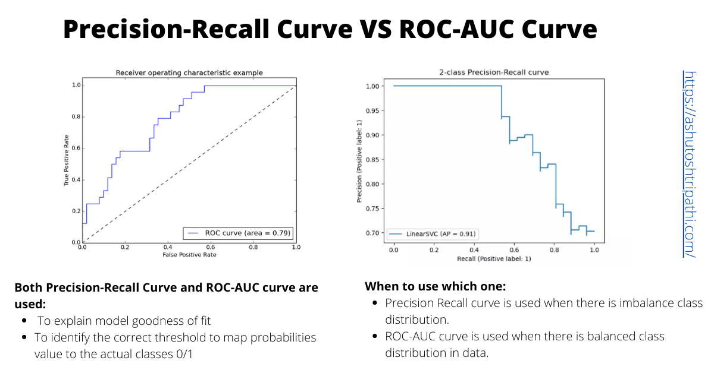
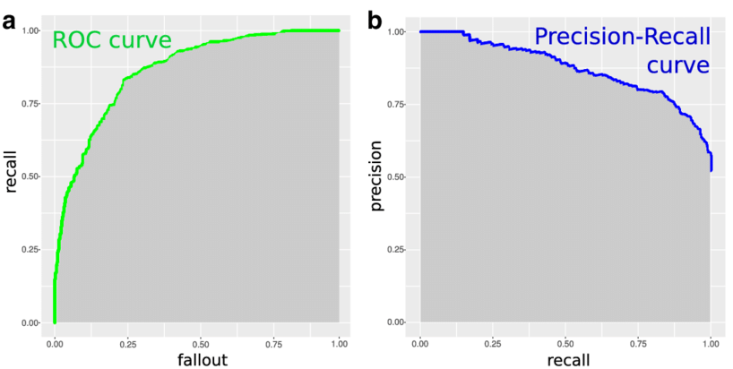

# 1. 프로젝트 개요 및 머신러닝에 대하여

## 1.1 프로젝트 개요

본 머신러닝 프로젝트는 수업 시간에 학습한 이론과 실습 내용을 실제 데이터에 적용하여, 다양한 문제 유형에 대한 모델링 경험과 성능 비교 분석 역량을 강화하는 것을 목적으로 수행되었다. 이를 위해 공개 데이터셋을 활용한 총 네 가지 주제를 선정하였으며, 각 주제는 데이터 특성과 문제 유형에 따라 서로 다른 머신러닝 기법을 적용하였다.

먼저, 캐글(Kaggle)의 Santander Bank Customer Satisfaction 데이터셋을 활용하여 고객 만족 여부를 예측하는 이진 분류 문제를 수행하였다. 해당 프로젝트에서는 불균형 데이터 처리, 평가 지표 선택, 앙상블 모델 적용을 중심으로 분석을 진행하였으며, 그 결과는 제2장에서 상세히 기술한다.

다음으로, 캐글의 Credit Card Fraud Detection 데이터셋을 이용하여 신용카드 거래 내역 기반의 사기 거래 탐지 분류 모델을 구축하였다. 이 프로젝트는 극심한 클래스 불균형 문제를 다루며, 재현율과 ROC-AUC 중심의 모델 평가가 핵심이 되었고, 관련 내용은 제3장에서 다룬다.

세 번째로, UCI Machine Learning Repository의 Opinion Review 데이터셋을 활용하여 비지도 학습 기반의 문서 클러스터링 및 문서 간 유사도 분석을 수행하였다. 해당 분석에서는 텍스트 벡터화 기법과 군집화 알고리즘을 적용하여 리뷰 문서의 잠재적 구조를 탐색하였으며, 이 과정과 결과는 제4장에 정리하였다.

마지막으로, 캐글의 Mercari Price Suggestion Challenge 데이터셋을 활용하여 상품 정보 기반의 가격 예측 회귀 문제를 수행하였다. 본 프로젝트에서는 텍스트와 정형 데이터를 결합한 특성 엔지니어링, 회귀 모델 비교 및 성능 최적화를 중심으로 분석을 진행하였으며, 이에 대한 내용은 제5장에서 상세히 기술한다.

이와 같이 본 보고서는 분류, 클러스터링, 회귀 등 다양한 머신러닝 문제 유형을 포괄하며, 각 장에서는 데이터 이해부터 모델링, 성능 평가까지의 전 과정을 체계적으로 서술함으로써 머신러닝 기법의 실질적인 활용 가능성을 검증하고자 한다.

### 1.1.1 머신러닝의 기본 개념 및 목표

머신러닝(Machine Learning)이란  **명시적인 규칙을 프로그래밍하지 않고**, 데이터로부터 패턴을 학습하여 예측이나 의사결정을 수행하는 알고리즘적 기법을 의미한다.
즉, 과거 데이터에 내재된 규칙성과 구조를 학습함으로써 **새로운 데이터에 대한 일반화된 예측**을 수행하는 것이 머신러닝의 핵심 목표이다.

머신러닝은 통계학과 선형대수, 확률 이론을 기반으로 하며, 데이터로부터 학습된 모델이 **예측 오차를 최소화하도록 파라미터를 반복적으로 갱신**한다.
이를 통해 단순한 규칙 기반 시스템보다 높은 예측 성능과 유연성을 확보할 수 있다.

본 프로젝트에서는 이러한 머신러닝 기법을 활용하여 **정형 데이터 기반 분류 문제를 해결**하고, 다양한 모델의 성능 비교 및 평가를 통해 최적의 모델을 도출하는 것을 목표로 한다.

### 1.1.2 정형 데이터 분류 문제 이해

정형 데이터란 각 관측치가 고정된 컬럼 구조를 가지며, 수치형 또는 범주형 변수로 구성된 테이블 형태의 데이터를 의미한다.
정형 데이터 분류 문제는 이러한 입력 변수들을 바탕으로 각 데이터가 **사전에 정의된 클래스(label)** 중 어디에 속하는지를 예측하는 문제이다.

대표적인 예로는 고객 이탈 여부 예측, 질병 진단, 스팸 메일 분류 등이 있으며, 본 프로젝트 또한 정형 데이터를 기반으로 한 이진 또는 다중 분류 문제를 다룬다.

### 1.1.3 모델 평가의 중요성

머신러닝 모델의 성능은 단순히 학습 데이터에서의 정확도가 아니라, **보지 못한 데이터에 대해 얼마나 잘 일반화되는가**에 의해 평가되어야 한다.

특히 분류 문제에서는 정확도(Accuracy)뿐 아니라 정밀도(Precision)와 재현율(Recall) 간의 상충 관계가 존재한다.
따라서 하나의 지표에만 의존하기보다는, 문제 특성에 맞는 평가 지표를 선택하고 **임계값(threshold)을 조화롭게 설정**하는 것이 중요하다.

본 프로젝트에서는 정확도, 정밀도, 재현율, F1 Score, ROC-AUC 등 다양한 지표를 활용하여 모델의 성능을 다각도로 평가한다.

## 1.2 분류 (Classification)

### 1.2.1 분류 개요

#### 1.2.1.1 분류 문제의 정의

분류(Classification)는 입력 데이터에 대해 사전에 정의된 클래스 레이블을 예측하는 지도학습 문제이다.
이진 분류(Binary Classification)와 다중 분류(Multi-class Classification)로 구분된다.

#### 1.2.1.2 평가 지표

| 평가 지표          | 정의                                              | 활용 시 고려 사항                                                                       |
| ------------------ | ------------------------------------------------- | --------------------------------------------------------------------------------------- |
| 정확도 (Accuracy)  | 전체 예측 중 올바르게 분류한 비율                 | 클래스 분포가 균형 잡힌 경우 직관적인 성능 지표이나, 불균형 데이터에서는 왜곡될 수 있음 |
| 정밀도 (Precision) | 모델이 양성으로 예측한 데이터 중 실제 양성의 비율 | False Positive를 최소화해야 하는 문제에 적합 (예: 스팸 메일 분류)                       |
| 재현율 (Recall)    | 실제 양성 데이터 중 모델이 올바르게 예측한 비율   | False Negative를 최소화해야 하는 문제에 중요 (예: 질병 진단, 사기 탐지)                 |
| F1 Score           | 정밀도와 재현율의 조화 평균                       | 정밀도와 재현율을 동시에 고려해야 하는 경우 적합                                        |

#### 1.2.1.3 혼동행렬 (Confusion Matrix)

혼동행렬은 실제 클래스와 예측 클래스의 조합을 행렬 형태로 표현하여 모델의 예측 성향을 직관적으로 파악할 수 있게 해준다.
TP, FP, TN, FN을 기반으로 다양한 평가 지표를 계산할 수 있다.

#### 1ROC 곡선과 AUC, PR 곡선과 PR-AUC

ROC(Receiver Operating Characteristic) 곡선은 분류 모델의 임계값(threshold)을 변화시키면서
**True Positive Rate(TPR)**와 False Positive Rate(FPR) 간의 관계를 시각적으로 나타낸 곡선이다.
이를 통해 특정 임계값에 의존하지 않고 모델의 전반적인 분류 성능을 평가할 수 있다.

**ROC 관련 지표 정의**

| 항목 | 영문 명칭                   | 정의                                              | 해석                                                    |
| ---- | --------------------------- | ------------------------------------------------- | ------------------------------------------------------- |
| TPR  | True Positive Rate (Recall) | 실제 양성 중 모델이 양성으로 올바르게 예측한 비율 | 재현율과 동일하며, 1에 가까울수록 양성 탐지 성능이 우수 |
| FPR  | False Positive Rate         | 실제 음성 중 모델이 양성으로 잘못 예측한 비율     | 0에 가까울수록 음성 오분류가 적음                       |

** ROC 관련 수식 정의 **

ROC 곡선은 위 두 비율을 기반으로 임계값 변화에 따라 생성되며, 곡선이 좌상단에 가까울수록 분류 성능이 우수함을 의미한다.

**AUC (Area Under the Curve)**

AUC는 ROC 곡선 아래 면적을 수치화한 값으로, 모델이 양성과 음성을 얼마나 잘 구분하는지를 나타내는 **임계값 독립적인 성능 지표**이다.

| 항목      | 설명                                             |
| --------- | ------------------------------------------------ |
| 값의 범위 | 0 ~ 1                                            |
| AUC = 1.0 | 완벽한 분류기                                    |
| AUC = 0.5 | 랜덤 분류기 수준                                 |
| AUC < 0.5 | 랜덤 분류기보다 성능이 낮음                      |
| 특징      | 데이터 불균형 상황에서도 정확도 대비 신뢰성 높음 |

**PR 곡선 (Precision–Recall Curve)**
PR(Precision–Recall) 곡선은 **정밀도(Precision)**와 재현율(Recall) 간의 관계를 나타내는 곡선으로,
특히 양성 클래스가 희소한 불균형 데이터 환경에서 모델의 실제 성능을 보다 민감하게 평가할 수 있는 지표이다.

| 지표      | 정의                                              |
| --------- | ------------------------------------------------- |
| Precision | 모델이 양성으로 예측한 것 중 실제 양성의 비율     |
| Recall    | 실제 양성 중 모델이 양성으로 올바르게 예측한 비율 |

**PR 관련 수식 정의**

**PR-AUC (Area Under the Precision–Recall Curve)**

PR-AUC는 PR 곡선 아래 면적을 의미하며,
특히 **False Positive의 증가가 중요한 문제(예: 사기 검출, 이상 탐지)**에서
모델의 실질적인 분류 성능을 평가하는 데 효과적이다.

PR-AUC는 ROC-AUC와 달리 클래스 분포의 영향을 크게 받으며,
양성 클래스가 희소한 경우 모델 간 성능 차이를 보다 명확히 드러낸다.

**ROC-AUC vs PR-AUC 비교**

| 항목                 | ROC-AUC                 | PR-AUC               |
| -------------------- | ----------------------- | -------------------- |
| 기준 축              | TPR vs FPR              | Precision vs Recall  |
| 임계값 의존성        | 없음                    | 없음                 |
| 클래스 불균형 민감도 | 상대적으로 낮음         | 매우 높음            |
| 활용 사례            | 일반적인 분류 성능 비교 | 사기 탐지, 이상 탐지 |

본 프로젝트에서는 Santander 고객 만족 예측과 같이 비교적 균형 잡힌 데이터에서는 ROC-AUC를 주요 지표로 활용하였으며, 신용카드 사기 검출 과제와 같이 극심한 클래스 불균형 문제가 존재하는 경우
ROC-AUC와 함께 PR-AUC를 보조 지표로 사용하여 모델 성능을 종합적으로 평가하였다.

### 1.2.2 결정 트리 (Decision Tree)

결정 트리는 데이터의 특징을 기준으로 질문을 반복적으로 분기하며 분류 규칙을 생성하는 모델로,
‘스무고개’ 게임과 유사한 방식으로 동작한다.

#### 1.2.2.1 결정 트리의 구조

* **루트 노드(Root Node)** : 첫 번째 분기 기준
* **결정 노드(Decision Node)** : 조건에 따른 중간 분기
* **리프 노드(Leaf Node)** : 최종 예측 결과

#### 1.2.2.2 불순도 측정

* **지니 계수(Gini Index)** : 노드 내 클래스 혼합 정도를 측정하며, 값이 작을수록 순수하다.
* **엔트로피(Entropy)** : 정보 이론 기반의 불확실성 척도이다.
* **정보 이득(Information Gain)** : 분기 전후의 불순도 감소량으로, 분기 기준 선택에 사용된다.

#### 1.2.2.3 하이퍼파라미터 및 과적합 제어

결정 트리 기반 모델은 구조적 특성상 과적합되기 쉬우므로,
트리의 복잡도와 학습 방식, 재현성을 제어하기 위한 다양한 하이퍼파라미터 설정이 필요하다.
본 프로젝트에서는 다음과 같은 주요 파라미터를 중심으로 모델을 구성하였다.

[표] 주요 하이퍼파라미터

| 파라미터          | 설명                           | 비고                       |
| ----------------- | ------------------------------ | -------------------------- |
| max_depth         | 트리의 최대 깊이               | 모델 복잡도 직접 제어      |
| min_samples_split | 노드 분할을 위한 최소 샘플 수  | 과도한 분기 방지           |
| min_samples_leaf  | 리프 노드의 최소 샘플 수       | 안정적인 예측값 확보       |
| max_features      | 분기 시 고려할 최대 피처 수    | 특정 피처 과의존 방지      |
| criterion         | 분기 기준 (gini, entropy)      | 불순도 측정 방식           |
| class_weight      | 클래스 가중치                  | 불균형 데이터 대응         |
| n_estimators      | 생성할 트리의 개수             | 앙상블 성능 및 안정성 향상 |
| n_jobs            | 병렬 처리에 사용할 CPU 코어 수 | 학습 시간 단축             |
| random_state ※   | 난수 시드(seed) 설정           | 실험 재현성 확보           |

**※ random_state 설정에 대한 설명**

본 프로젝트에서는 random_state = 23으로 고정하여 모든 실험을 수행하였다.
이는 실험 결과의 재현성을 확보하기 위한 설정이며,
동시에 “제2 프로젝트, 3조”를 의미하는 숫자를 활용하여
팀 단위 실험 환경을 일관되게 유지하고자 하는 의도를 반영한 것이다.

난수 시드를 고정함으로써 데이터 분할, 부트스트랩 샘플링, 피처 선택 과정에서
동일한 결과를 반복적으로 얻을 수 있으며,
이는 모델 성능 비교 및 하이퍼파라미터 튜닝 과정의 신뢰성을 높이는 데 기여한다.

#### 1.2.2.4 시각화 및 Feature Importance

결정 트리(Decision Tree)는 모델 구조와 의사결정 과정을 시각적으로 확인할 수 있어 다른 머신러닝 모델에 비해 해석 가능성(interpretability)이 높은 장점을 가진다.
이를 통해 모델이 어떤 기준으로 분류를 수행하는지 직관적으로 이해할 수 있다.

트리 구조의 시각화는 scikit-learn에서 제공하는 plot_tree() 함수를 활용하여 각 노드의 분기 조건, 클래스 분포, 불순도 값을 확인할 수 있으며, 보다 직관적인 시각화를 위해 dtreeviz 라이브러리를 사용할 수 있다.
이러한 시각화 결과는 matplotlib 기반으로 출력되며, 보고서 및 분석 결과 설명에 효과적으로 활용할 수 있다.

또한 결정 트리는 각 입력 피처가 분류 결과에 기여한 정도를 Feature Importance 형태로 제공한다. 이는 불순도 감소량을 기준으로 산출되며, 중요도가 높은 변수일수록 모델 예측에 더 큰 영향을 미쳤음을 의미한다.

Feature Importance 결과는 matplotlib과 seaborn을 활용하여 막대 그래프(bar plot) 형태로 시각화할 수 있으며, 이를 통해 주요 변수 간 상대적 중요도를 한눈에 비교할 수 있다.
이러한 시각화는 모델 성능 분석뿐 아니라 데이터 이해 및 특성 선택(feature selection)에 있어 중요한 참고 자료로 활용된다.

### 1.2.3 앙상블 학습 (Ensemble Learning)

앙상블 학습(Ensemble Learning)은 여러 개의 개별 모델(base learner)을 결합하여
단일 모델보다 일반화 성능과 예측 안정성을 향상시키는 머신러닝 기법이다.
각 모델의 약점을 상호 보완함으로써 분산 감소 및 성능 향상을 달성하는 것을 목표로 한다.

앙상블 학습 기법 비교

| 기법              | 개념                         | 학습 방식 | 주요 특징                             | 대표 모델              |
| ----------------- | ---------------------------- | --------- | ------------------------------------- | ---------------------- |
| 보팅 (Voting)     | 여러 모델의 예측 결과를 결합 | 병렬 학습 | 구현이 간단하며 다양한 모델 조합 가능 | VotingClassifier       |
| 하드 보팅         | 다수결 기반 최종 예측        | 병렬 학습 | 클래스 예측값 기준                    | -                      |
| 소프트 보팅       | 예측 확률 평균 기반          | 병렬 학습 | 확률 정보 활용으로 일반적으로 더 우수 | -                      |
| 배깅 (Bagging)    | 데이터 샘플링 기반 앙상블    | 병렬 학습 | 분산 감소, 과적합 완화                | Random Forest          |
| 부스팅 (Boosting) | 오차 보완형 순차 학습        | 순차 학습 | 학습 성능 향상, 약한 학습기 결합      | AdaBoost, GBM, XGBoost |

**앙상블 학습의 장점**

- 단일 모델 대비 예측 안정성 향상
- 과적합 감소 및 일반화 성능 개선
- 다양한 모델의 장점을 결합 가능

앙상블 기법은 이후 설명하는 랜덤 포레스트, XGBoost, LightGBM과 같은 고성능 모델의 핵심 기반 개념으로 활용되며,
본 프로젝트에서도 여러 앙상블 기법을 적용하여 모델 성능을 비교·분석하였다.

### 1.2.4 랜덤 포레스트 (Random Forest)

랜덤 포레스트는 다수의 결정 트리를 결합한 배깅 기반 앙상블 모델이다.
각 트리는 서로 다른 데이터 샘플과 피처 부분집합을 사용하여 학습되며, 소프트 보팅을 통해 최종 예측을 수행한다.

* 병렬 처리 지원(n_jobs)
* 주요 파라미터: n_estimators, max_features, max_depth

### 1.2.5 XGBoost

XGBoost(eXtreme Gradient Boosting)는 Gradient Boosting Machine(GBM)을 기반으로 한
고성능 앙상블 알고리즘으로, 정규화 기법과 병렬 처리, 조기 중단(Early Stopping) 기능을 통해
높은 예측 성능과 학습 효율을 동시에 제공한다.

XGBoost는 L1(Lasso) 및 L2(Ridge) 규제를 내장하고 있어
모델 복잡도를 제어하고 과적합을 효과적으로 완화할 수 있으며,
트리 생성 과정에서 병렬 연산을 지원하여 대규모 데이터에서도 빠른 학습이 가능하다.
또한 GPU 가속 연산을 지원하여, CPU 기반 학습 대비
학습 시간을 크게 단축할 수 있다는 장점이 있다.

본 프로젝트에서는 Mercari Price Suggestion Challenge를 포함한 후반부 두 개의 분석 과정에서
XGBoost의 GPU 학습 기능을 활용하여 모델을 학습하였으며, 이를 통해 대용량 데이터 환경에서도 효율적인 실험 수행이 가능하였다.

XGBoost는 Python 전용 래퍼와 Scikit-Learn 래퍼를 모두 제공하여, 사용 목적에 따라 유연하게 적용할 수 있다.

### 1.2.6 LightGBM

LightGBM은 대용량 데이터 처리를 위해 설계된 Gradient Boosting 기반 모델로,
리프 중심 트리 분할(Leaf-wise) 방식을 채택하여 기존 레벨 중심(Level-wise) 방식 대비 빠른 학습 속도를 제공한다.

LightGBM은 메모리 사용량이 적고,조기 중단(Early Stopping) 기능을 통해 불필요한 학습 반복을 방지할 수 있다.
또한 GPU 가속 학습을 지원하여, 고차원 데이터 및 대규모 학습 환경에서 효율적인 모델 학습이 가능하다.

본 프로젝트에서는 XGBoost와 함께 LightGBM의 GPU 학습 기능을 활용하여 Mercari Price Suggestion Challenge 분석을 수행하였으며,
이를 통해 학습 시간 단축과 반복 실험의 효율성을 동시에 확보하였다.

주요 하이퍼파라미터로는 num_leaves, min_data_in_leaf 등이 있으며,
이들은 모델의 복잡도와 일반화 성능을 결정하는 핵심 요소로 작용한다.

### 1.2.7 하이퍼파라미터 튜닝

머신러닝 모델의 성능은 알고리즘 선택뿐 아니라 하이퍼파라미터 설정에 크게 의존한다.
따라서 적절한 하이퍼파라미터 탐색 과정은 모델 성능 최적화를 위한 필수 단계이다.

전통적인 방법인 GridSearchCV는 미리 정의된 파라미터 조합을 전수 탐색하는 방식으로,
탐색 공간이 커질수록 계산 비용과 시간이 급격히 증가하는 한계가 있다.
특히 트리 기반 앙상블 모델이나 대용량 데이터 환경에서는 실질적인 적용이 어려운 경우가 많다.

이에 비해 **베이지안 최적화(Bayesian Optimization)**는 이전 탐색 결과를 바탕으로 조건부 확률 모델을 갱신하며,
성능 개선 가능성이 높은 영역을 중심으로 효율적인 탐색을 수행한다.
이를 통해 제한된 횟수의 실험만으로도 준최적 또는 최적의 하이퍼파라미터 조합을 찾을 수 있다.

본 프로젝트에서는 HyperOpt 라이브러리를 활용하여 TPE(Tree-structured Parzen Estimator) 알고리즘 기반의
베이지안 최적화 방식으로 하이퍼파라미터 튜닝을 수행하였다.
탐색 공간(Search Space)은 hp.uniform(), hp.quniform() 등을 이용해 정의하고,
목표 함수(Objective Function)로는 검증 데이터 성능 지표를 최소화(또는 최대화)하도록 설정하였다.

실제 실험 과정에서 하이퍼파라미터 튜닝은 모델과 데이터 크기에 따라 기본적으로 약 1시간에서 최대 6시간 이상의 계산 시간이 소요되었으며,
특히 XGBoost와 LightGBM과 같은 부스팅 모델의 경우 탐색 범위와 반복 횟수에 따라 상당한 연산 자원이 요구되었다.
이러한 경험을 통해 하이퍼파라미터 튜닝은 단순한 설정 단계가 아니라, 모델 성능과 실험 효율성을 동시에 고려해야 하는 중요한 설계 과정임을 확인하였다.

### 1.2.8 스태킹 앙상블(Stacking Ensemble)

스태킹(Stacking Ensemble)은 서로 다른 머신러닝 모델들의 예측 결과를
새로운 입력 데이터로 활용하여, 이를 기반으로 **메타 모델(Meta Model)**이 최종 예측을 수행하는 앙상블 학습 기법이다.
단순 평균이나 다수결 방식과 달리, 모델 간 예측 패턴의 차이를 학습함으로써 성능 향상을 도모한다는 점에서 차별화된다.

스태킹 구조에서는 먼저 여러 개의 **기본 모델(Base Learner)**이
동일한 학습 데이터를 기반으로 개별 예측을 수행하고, 이 예측 결과를 새로운 특성(feature)으로 구성한다.
이후 메타 모델은 이러한 예측값들을 입력으로 받아 각 기본 모델의 강점과 약점을 학습하여 최종 출력을 생성한다.

본 프로젝트에서는 분류 및 회귀를 포함한 모든 과제에서 스태킹 앙상블을 공통적으로 적용하였다.
이를 통해 단일 모델이나 단순 앙상블 기법으로는 포착하기 어려운 복합적인 데이터 패턴을 보다 효과적으로 학습할 수 있었다.
특히 서로 다른 알고리즘 특성을 가진 모델들을 조합함으로써 모델 간 상호 보완성을 극대화하고,
전반적인 일반화 성능을 안정적으로 향상시킬 수 있었다.

메타 모델로는 문제 유형에 따라 로지스틱 회귀 또는 선형 회귀와 같은 비교적 단순하고 해석 가능한 모델을 사용하여,
과적합 위험을 줄이는 동시에 예측 결과의 안정성을 확보하였다.
또한 교차 검증 기반 예측값을 활용함으로써 정보 누수(data leakage)를 방지하고 스태킹 구조의 신뢰성을 높였다.

이와 같은 스태킹 앙상블 전략은 Santander 고객 만족 예측, 신용카드 사기 검출, Mercari 가격 예측 등 다양한 문제 유형에서
전반적으로 일관된 성능 개선 효과를 보이며, 본 프로젝트 전반에 걸쳐 핵심적인 성능 향상 기법으로 활용되었다.
다만 모든 경우에서 스태킹이 단일 모델이나 다른 앙상블 기법 대비 항상 최적의 성능을 보인 것은 아니었으며,
데이터 특성이나 기본 모델 조합, 메타 모델 선택에 따라 성능 차이가 발생함을 확인하였다.

그럼에도 불구하고 스태킹은 여러 모델의 예측 결과를 입력으로 사용하는 메타 모델을 통해
각 모델의 강점을 효과적으로 결합할 수 있는 앙상블 기법으로,
적절한 구성과 검증 과정을 거칠 경우 모델 간 상호 보완성을 극대화할 수 있는 유연한 전략임을 확인할 수 있었다.

## 1.3 회귀 (Regression)

### 1.3.1 다항 회귀와 과적합/과소적합

선형 회귀는 복잡한 비선형 관계를 설명하는 데 한계가 있으며, 다항 특성 추가를 통해 이를 보완할 수 있다.
그러나 모델 복잡도가 증가하면 과적합 위험이 커지므로 제어가 필요하다.

### 1.3.2 규제 선형 모델 (Regularized Linear Models)

규제 선형 모델은 선형 회귀 모델에 규제(Regularization) 항을 추가하여 모델의 가중치 크기를 제한함으로써 과적합을 방지하고
보지 못한 데이터에 대한 일반화 성능을 향상시키는 기법이다.
특히 다중공선성(multicollinearity)이 존재하거나 고차원 데이터 환경에서 효과적으로 활용된다.

#### 1.3.2.1 Ridge Regression (L2 규제)

Ridge 회귀는 가중치의 제곱합(L2 norm)에 패널티를 부여하여 계수의 크기를 전반적으로 줄이는 방식이다.
모든 변수를 유지한 채 모델을 안정화시키는 데 강점이 있으며, 다중공선성이 존재하는 경우 예측 성능 향상에 효과적이다.

#### 1.3.2.2 Lasso Regression (L1 규제)

Lasso 회귀는 가중치의 절댓값 합(L1 norm)에 패널티를 부여하여 일부 계수를 정확히 0으로 만드는 특성을 가진다.
이를 통해 자동 변수 선택(feature selection) 효과를 제공하며, 모델 해석성을 높이는 데 유리하다.

#### 1.3.2.3 Elastic Net (L1 + L2 규제)

Elastic Net은 L1과 L2 규제를 결합한 방식으로, Ridge의 안정성과 Lasso의 변수 선택 특성을 동시에 활용한다.
상관관계가 높은 변수들이 다수 존재하는 경우에도 안정적인 모델 학습이 가능하다.

이와 같은 규제 기법은 모델의 복잡도를 효과적으로 제어함으로써
과적합을 완화하고 예측 성능의 안정성을 높이는 데 기여한다.

### 1.3.3 로지스틱 회귀 (Logistic Regression)

로지스틱 회귀(Logistic Regression)는 이름에 ‘회귀’가 포함되어 있으나,
실제로는 이진 분류(Binary Classification) 문제를 해결하기 위한 대표적인 지도학습 모델이다.
선형 결합된 입력 변수의 값을 **확률(probability)**로 변환하여 클래스에 대한 예측을 수행한다.

로지스틱 회귀는 입력 특성과 가중치의 선형 결합 결과를 시그모이드 함수(Sigmoid Function)에 통과시켜 0과 1 사이의 값을 출력한다.
이 출력 값은 특정 클래스(일반적으로 Positive 클래스)에 속할 확률로 해석되며,
사전에 정의된 임계값(threshold)을 기준으로 최종 클래스를 결정한다.

모델 학습 과정에서는 평균 제곱 오차 대신 **로그 손실(Log Loss, Cross-Entropy Loss)**을 목적 함수로 사용하여,
예측 확률과 실제 레이블 간의 차이를 최소화하도록 가중치를 최적화한다.
이를 통해 확률적 해석이 가능하며, 분류 문제에서 안정적인 성능을 제공한다.

로지스틱 회귀는 구조가 단순하고 해석이 용이하다는 장점이 있어,
각 특성이 결과에 미치는 영향을 계수(coefficient)를 통해 직관적으로 이해할 수 있다.
또한 L1(Lasso) 또는 L2(Ridge) 규제를 적용함으로써 과적합을 제어할 수 있으며,
이는 고차원 정형 데이터 분석에서 특히 유용하다.

다만 입력 변수와 타깃 간의 관계를 선형적으로 가정하므로,
복잡한 비선형 패턴을 학습하는 데에는 한계가 존재한다.
이러한 경우 결정 트리나 앙상블 기반 분류 모델이 대안으로 활용된다.

### 1.3.4 회귀 트리 (Regression Tree)

회귀 트리(Regression Tree)는 연속형(target) 값을 예측하기 위한 결정 트리 기반의 회귀 모델로,
분류 트리(Classification Tree)와 구조는 유사하지만 리프 노드에서 클래스가 아닌 수치값을 예측한다는 점에서 차이가 있다.

회귀 트리는 입력 특성(feature)을 기준으로 데이터를 반복적으로 분할하며,
각 분기에서 노드 내 오차를 최소화하는 방향으로 분할 기준을 선택한다.
일반적으로 분기 기준은 평균 제곱 오차(Mean Squared Error, MSE) 또는 분산 감소(Variance Reduction)를 최소화하도록 설정된다.

리프 노드에서는 해당 노드에 속한 학습 데이터의 타깃 값 평균을 예측값으로 사용하며,
이를 통해 비선형적인 데이터 관계를 효과적으로 모델링할 수 있다.
그러나 분류 트리와 마찬가지로 단일 회귀 트리는 데이터에 과적합되기 쉬운 단점이 존재한다.

이러한 한계를 보완하기 위해 회귀 트리는 랜덤 포레스트(Random Forest Regressor)나
그래디언트 부스팅 회귀(Gradient Boosting Regressor), XGBoost, LightGBM과 같은
앙상블 회귀 모델의 기본 구성 요소(base learner)로 널리 활용된다.

## 1.4 결론

본 장에서는 머신러닝의 기본 개념과 분류·회귀 문제에 대한 주요 알고리즘 및 평가 지표를 정리하고, 이를 바탕으로 본 프로젝트에서 수행한 네 가지 실습 과제의 공통된 분석 관점을 제시하였다. 본 프로젝트는 서로 다른 데이터 특성과 문제 유형을 가진 사례들을 통해 머신러닝 기법의 적용 범위와 한계를 종합적으로 이해하는 데 목적이 있다.

먼저, Santander Bank Customer Satisfaction과 Credit Card Fraud Detection 프로젝트는 모두 정형 데이터를 기반으로 한 이진 분류 문제라는 공통점을 가지지만, 데이터 분포와 분석 목적에서 차이를 보였다. Santander 데이터는 비교적 완만한 불균형 구조를 가지며 전반적인 분류 성능 향상이 중요했던 반면, 신용카드 사기 검출 문제는 극심한 클래스 불균형으로 인해 정확도보다는 재현율과 ROC-AUC가 핵심 평가 지표로 작용하였다. 이를 통해 분류 문제에서는 데이터 특성에 따라 평가 지표 선택과 임계값 설정 전략이 달라져야 함을 확인하였다.

UCI Opinion Review 데이터셋을 활용한 클러스터링 및 문서 유사도 분석은 앞선 분류 문제와 달리 정답 레이블이 존재하지 않는 비지도 학습 문제로, 데이터의 잠재적 구조를 탐색하는 데 중점을 두었다. 이 과정에서 텍스트 벡터화 방식과 거리 기반 유사도 계산이 결과에 큰 영향을 미친다는 점을 확인하였으며, 머신러닝이 예측뿐 아니라 데이터 이해와 구조 분석에도 효과적으로 활용될 수 있음을 보여주었다.

마지막으로, Mercari Price Suggestion Challenge 프로젝트는 회귀 문제를 통해 연속형 값을 예측하는 사례로, 분류 문제와는 다른 관점의 모델 평가와 특성 설계가 요구되었다. 특히 텍스트 데이터와 정형 데이터를 결합한 피처 엔지니어링의 중요성과, 규제 모델 및 앙상블 기법을 통한 일반화 성능 향상의 필요성을 확인할 수 있었다.

종합적으로 본 프로젝트는 분류, 비지도 학습, 회귀 문제를 아우르는 다양한 사례를 통해 머신러닝 모델 선택, 평가 지표 설정, 데이터 특성 이해의 중요성을 실증적으로 확인하였다. 이러한 경험은 이후 실제 데이터 분석 및 머신러닝 프로젝트 수행 시 문제 유형에 적합한 접근 전략을 수립하는 데 중요한 기반이 될 것으로 기대된다.
