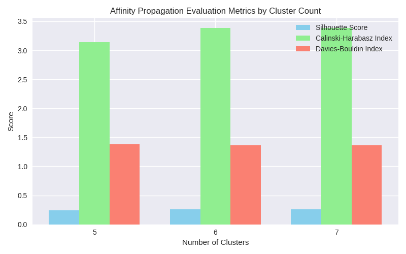

**Affinity Propagation** 알고리즘에서 클러스터 수를 5, 6, 7로 했을 때의 평가 지표가 어떻게 변하는지 비교할 수 있습니다.

---

### 📊 결과 비교

| 목표 클러스터 수 | Silhouette | Calinski-Harabasz | Davies-Bouldin |
| ---------------- | ---------- | ----------------- | -------------- |
| 5                | 0.2434     | 3.1388            | 1.3826         |
| 6                | 0.2618     | 3.3883            | 1.3627         |
| 7                | 0.2618     | 3.3883            | 1.3627         |

---

### 🔍 분석 포인트

1. **Silhouette Score (군집 분리도)**

   - 5개 클러스터일 때보다 6개 클러스터에서 점수가 **상승(0.2434 → 0.2618)**했습니다.
   - 6과 7에서는 동일한 값으로 유지 → 즉, 6개 이상으로 늘려도 추가적인 개선은 없다는 의미입니다.
   - 결론: **6개 클러스터가 가장 안정적이고 분리도가 좋은 상태**입니다.
2. **Calinski-Harabasz Index (군집 간 분산 대비 내부 밀집도)**

   - 5개에서 3.1388 → 6개에서 3.3883으로 상승.
   - 7개에서도 동일하게 유지.
   - 이는 **6개 클러스터에서 내부 밀집도와 외부 분산이 가장 균형 있게 잡혔다**는 뜻입니다.
3. **Davies-Bouldin Index (군집 간 유사도)**

   - 5개에서 1.3826 → 6개에서 1.3627로 소폭 감소 (좋은 방향).
   - 7개에서도 동일.
   - 즉, **6개 클러스터에서 군집 간 유사도가 가장 낮아 품질이 좋음**을 보여줍니다.

---

### ✅ 종합 결론

- **5개 클러스터**: 군집 품질이 다소 낮음.
- **6개 클러스터**: 모든 지표가 개선되어 가장 좋은 결과.
- **7개 클러스터**: 6개와 동일한 성능 → 불필요하게 클러스터 수만 늘어난 상태.

👉 따라서 이 데이터에서는 **Affinity Propagation을 사용할 때 목표 클러스터 수를 6으로 설정하는 것이 최적**이라고 해석할 수 있습니다.

---

**Affinity Propagation 클러스터 수별 평가 지표 막대그래프**를 준비했어요.
아래 그래프에서 클러스터 수 5, 6, 7일 때의 Silhouette, Calinski-Harabasz, Davies-Bouldin 값을 한눈에 비교할 수 있습니다.

---

### 🔍 그래프 해석

- **Silhouette Score**: 6개 클러스터에서 가장 높음 → 군집 분리도가 가장 좋음
- **Calinski-Harabasz Index**: 6개 클러스터에서 최고치 → 군집 간 분산 대비 내부 밀집도가 가장 균형적
- **Davies-Bouldin Index**: 6개 클러스터에서 가장 낮음 → 군집 간 유사도가 가장 적음

👉 결론적으로, **6개 클러스터가 최적의 선택**으로 보입니다.

원하시면 이 그래프를 **라인 그래프 형태로 변환**해서 클러스터 수 변화에 따른 지표 추세를 더 직관적으로 보여드릴 수도 있습니다.
